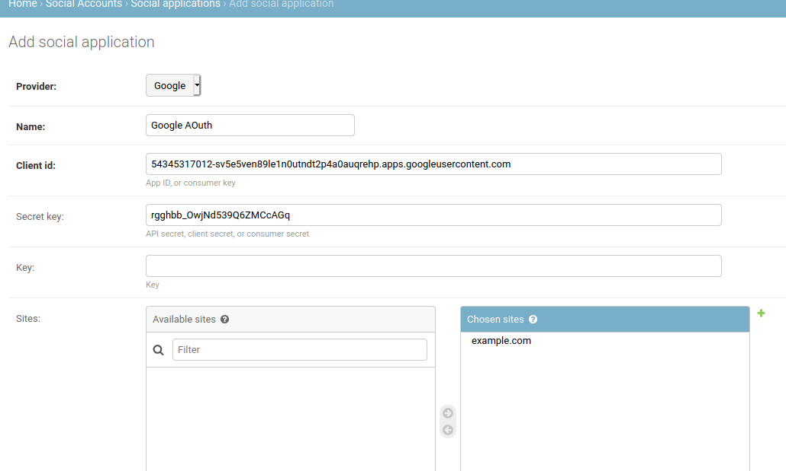
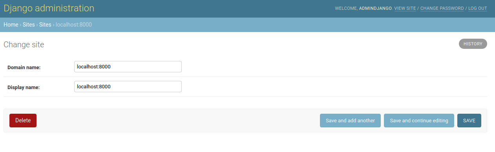

# Sistema de Gestión de Configuración de artefactos de Software

#### Descripción

Proyecto desarrollado en Python con el Framework de Django que implementa un sistema de gestión de configuración de artefactos de software y su completa trazabilidad. 

#### Herramientas utilizadas

**Integrated Development Environment :** Pycharm Professional Edition 

**Lenguaje de Programación:** Python 

**Framework:** Django 3.0.7

**SGBD:** PostgreSQL version-13 y PgAdmin 4 

**Stack tecnológico del proyecto:**

- HTML 
- CSS
- JavaScript
- Django
- Apache ( Producción Local )
- PostgreSQL 

#### **Development team**

- Maricel Torres
- Alex Gómez
- Guillermo Gimenez 

- Victor Gonzalez

  

#### Módulos del Sistema:

- **Módulo de Administración:** Módulo que permite la administración de usuarios y roles, además de configuraciones del sistema.  

  | **Gestión de Configuraciones técnicos del Sistema**          |
  | ------------------------------------------------------------ |
  | Autenticación SSO\|Archivos en la Nube \| Otras configuraciones técnicas. |
  | **Gestión de Usuarios**                                      |
  | Crear usuario \| Modificar usuario \| Eliminar usuario \| Consultar usuario Asignar usuario \| Desasignar usuario |
  | **Gestión de Permisos del Sistema**                          |
  | **Gestión de Roles**                                         |
  | Crear rol  \| Eliminar rol \| Modificar rol                  |
  | **Gestión de Tipos de ítem**                                 |
  | Crear tipo de ítem \| Eliminar tipo de ítem \| Importar tipo de ítem \| Modificar tipo de ítem |
  | **Gestión de Proyectos**                                     |
  | Crear Proyecto \| Iniciar Proyecto \| Modificar Proyecto \| Eliminar Proyecto \| Cancelar Proyecto |

  

- **Módulo de Gestión de configuración:** Módulo que permite la generación de líneas bases. Deberá permitir el control de las líneas bases generadas por producto y la administración de los cambios de los elementos que se encuentren en las líneas bases.  

  | **Gestión de Línea Base**                                    |
  | ------------------------------------------------------------ |
  | Crear línea base \| Modificar línea base \| Aprobar línea base \| Aprobar fase \| Desactivar línea base \| Agregar Solicitud \| Modificar Solicitud \| Eliminar Solicitud \| Aprobar Solicitud \| Rechazar Solicitud |

- **Módulo de Desarrollo:** Módulo que administra todos los elementos de los productos.  

| **Gestión de ítem**                                          |
| ------------------------------------------------------------ |
| Crear ítem \| Modificar ítem \| Eliminar ítem \|  Aprobar ítem  \| Establecer relación \|  Modificar relación \| Eliminar relación \|Historial de Cambios |
| **Gestión de Fases**                                         |
| Crear fase\| Modificar fase \| Eliminar fase \| Aprobar fase |

#### ¿Cómo utilizar? 

**Crear la base de datos de desarrollo con el nombre de** `desarrollo`

**Construir el proyecto**

 Abrir PyCharm click en get from VCS y insertar : https://github.com/geekpy03/sgcas.git

**Ir en la siguiente ruta:  ~/sgcas/deployment** y crear una carpeta llamada media  :  `mkdir media`

**Luego a la ruta**  ~/sgcas/apps 

| Crear las carpetas migrations y archivo __init_**_.py        |
| ------------------------------------------------------------ |
| mkdir comite/migrations luego touch comite/migrations/\__init__.py |
| mkdir fase/migrations  luego  touch fase/migrations/\__init__.py |
| mkdir item/migrations  luego touch item/migrations/\__init__.py |
| mkdir linea_base/migrations luego touch linea_base/migrations/\__init__.py |
| mkdir proyecto/migrations luego touch proyecto/migrations/\__init__.py |
| mkdir rol/migrations luego touch rol/migrations/\__init__.py |
| mkdir tipo_item/migrations  luego touch tipo_item/migrations/\__init__.py |
| mkdir usuario/migrations luego touch usuario/migrations/\__init__.py |

**Crear un entorno virtual  :** PyCharm ya lo crea por defecto.

**Levantar un entorno virtual :** PyCharm ya lo levanta por defecto.

**Iniciar el entorno virtual :** PyCharm ya lo inicia por defecto.

**Instalar las dependencias** `pip install -r requirements.txt`

Estando en la ruta ~/sgcas, realizar las migraciones en la base de datos 

`python manage.py makemigrations`

`python manage.py migrate`

Ya por defecto el proyecto crea un superUsuario de la pagina de administración de django con los siguientes datos: 

**usuario		:** AdminDjango

**password	:** qwertydjango 

**El proyecto se levantara en el servidor de desarrollo :** http://127.0.0.1:8000/

**Para acceder a la administración de Django:**  http://127.0.0.1:8000/admin

***Configurar Google SSO***

Ir al apartado **social application  / agregar nuevo**  y colocar los siguientes datos: 

**Provider** : Google 

**Name :** Google AOuth

**Cliente id:** 54345317012-sv5e5ven89le1n0utndt2p4a0auqrehp.apps.googleusercontent.com

**Secret Key:** rgghbb_OwjNd539Q6ZMCcAGq

y elegir el sites **example.com**

Luego editar el example.com en el apartado **sites** , dejandolo de esta manera. 

Y el sistema ya esta listo para ser usado. 
